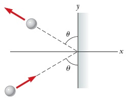
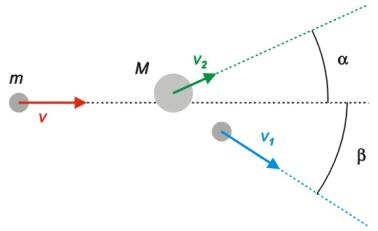
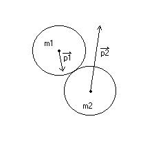
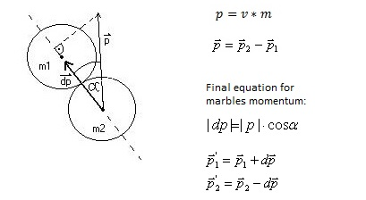
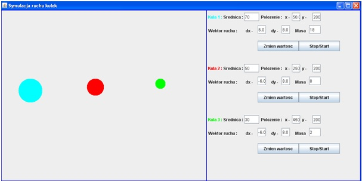
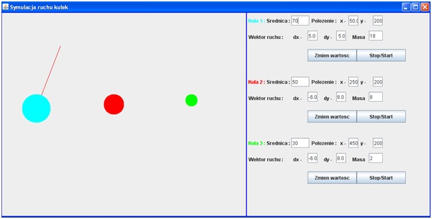
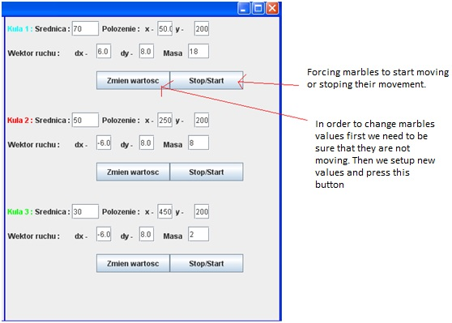

# Marbles-java

## Table of contents
* [General info](#general-info)
* [Technologies](#technologies)
* [Algorithms](#algorithms)
* [Program example](#examples)

## General info
2D Moving marbles simulation with collision detection. Marbles are moving with constant value, without drag, collisions calculated between them are elastic and in the most cases not central. 
	
## Technologies
Project is created with:
* Java 
* Swing
* Awt
* Java2d
* Netbeans

## Algorithms

Image presents problem with using java2d. Circle isnt drawn from circle's center. Drawning starts from top, left side of it. Thats why small calculation correction of axis_x and axis_y  is needed.
 

 In case of collision with wall angle of reflection stays the same thats why just changing moving vector dirrection to opposite is enough to calculate new velocity.

Example of not centrall collision when marbles are not facing each other.

Situation becomes more complex when 2d marbles are colliding facing each other. To solve that problem, equation to calculate the momentum with additonal angle of reflection is being used.

## Examples 

GUI presentation.

In order to set marble's moving vector user can hover with mouse over chosen marble, then press left mouse button and arrow will pop up that will allow to chose direction, as in the example above.

Second option is to input raw data in right section of interface.
