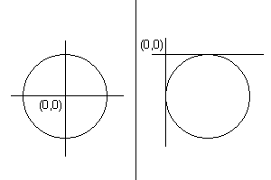

# Marbles-java

## Table of contents
* [General info](#general-info)
* [Technologies](#technologies)
* [Algorithms](#algorithms)

## General info
2D Moving marbles simulation with collision detection. Marbles are moving with constant value, collisions calculated between them are elastic and in the most cases not central. 
	
## Technologies
Project is created with:
* Java 
* Swing
* Awt
* Java2d
* Netbeans

## Algorithms

Image presents problem with using java2d. Circle isnt drawn from circle's center. Drawning start from top,left side of it. Thats why small calculation correctnes is needed.
 

